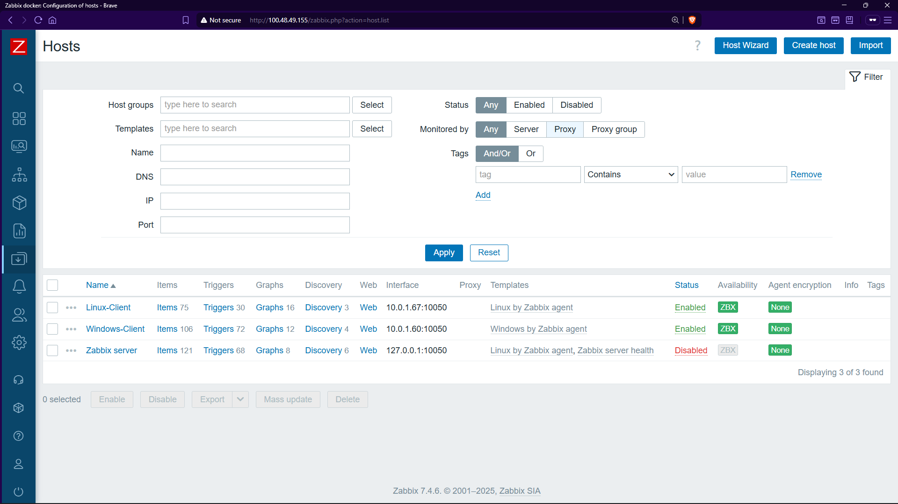
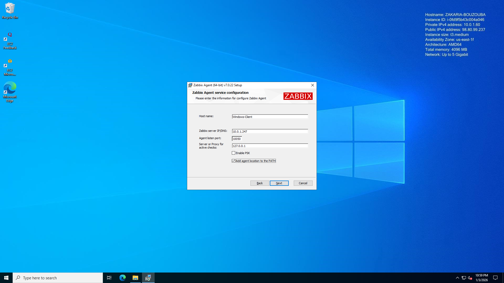

# AWS + Zabbix — Hybrid Cloud Monitoring Infrastructure


Centralised monitoring of a hybrid infrastructure (Linux + Windows) deployed on AWS using Zabbix 7.0 via Docker.

---

## Table of Contents

- [Project Overview](#project-overview)
- [Architecture](#architecture)
- [Repository Structure](#repository-structure)
- [Prerequisites](#prerequisites)
- [Deployment Guide](#deployment-guide)
  - [1. AWS Infrastructure Setup](#1-aws-infrastructure-setup)
  - [2. Zabbix Server (Docker)](#2-zabbix-server-docker)
  - [3. Linux Agent](#3-linux-agent-ubuntu)
  - [4. Windows Agent](#4-windows-agent)
  - [5. Adding Hosts in Zabbix UI](#5-adding-hosts-in-zabbix-ui)
- [Configuration Reference](#configuration-reference)
- [Monitoring Dashboard](#monitoring-dashboard)
- [Troubleshooting](#troubleshooting)
- [Author](#author)

---

## Project Overview

This project implements a centralised supervision infrastructure hosted on AWS, designed to monitor a hybrid server environment (Linux + Windows). Zabbix is deployed via Docker Compose for isolation and portability.

### Objectives

| # | Goal |
|---|------|
| 1 | Deploy a secure VPC on AWS with appropriate Security Groups |
| 2 | Run Zabbix Server 7.0 in Docker containers — no host installation |
| 3 | Configure Zabbix Agents on Ubuntu and Windows Server instances |
| 4 | Visualise real-time metrics: CPU, RAM, disk I/O, and host availability |

---

## Architecture

The deployment targets AWS region `us-east-1` with all instances in a single public subnet.

```
+----------------------------------------------------------------------+
|  AWS Region: us-east-1                                               |
|  +----------------------------------------------------------------+  |
|  |  VPC: 10.0.0.0/16                                              |  |
|  |  +----------------------------------------------------------+  |  |
|  |  |  Public Subnet: 10.0.1.0/24                              |  |  |
|  |  |                                                           |  |  |
|  |  |  +--------------------+  TCP 10050  +-----------------+  |  |  |
|  |  |  |  Zabbix Server     |<----------->|  Linux Agent    |  |  |  |
|  |  |  |  (Docker)          |             |  Ubuntu 24.04   |  |  |  |
|  |  |  |  t3.medium         |  TCP 10050  +-----------------+  |  |  |
|  |  |  |  Port 80 (Web UI)  |<----------->|  Windows Agent  |  |  |  |
|  |  |  |  Port 10051 (Srv)  |             |  Server 2022    |  |  |  |
|  |  |  +--------------------+             +-----------------+  |  |  |
|  |  +----------------------------------------------------------+  |  |
|  +----------------------------------------------------------------+  |
|                         Internet Gateway                             |
+----------------------------------------------------------------------+
                                  ^
                            Administrator
                            (HTTP port 80)
```

Communication flow: the Zabbix Server polls agents on TCP port 10050 (passive mode). Agents do not initiate connections to the server.

---

## Repository Structure

```
.
├── README.md                    — This file
├── docker-compose.yml           — Zabbix stack (Server + Web + MySQL)
├── .env.example                 — Environment variable template
├── commands_memo.sh             — Quick-reference shell commands
├── zabbix_agentd_sample.conf    — Minimal agent config for Linux
├── TROUBLESHOOTING.md           — Common issues and fixes
└── screenshots/
    ├── fig1.png   VPC creation
    ├── fig2.png   Subnet configuration
    ├── fig3.png   Security Group rules
    ├── fig4.png   EC2 instances overview
    ├── fig5.png   Docker containers running
    ├── fig6.png   Zabbix login page
    ├── fig7.png   Zabbix dashboard
    ├── fig8.png   Host status (green ZBX)
    └── fig9.png   Metrics graphs
```

---

## Prerequisites

- An AWS Academy account (Learner Lab) or standard AWS account
- An SSH client (Terminal, PuTTY) and an RDP client
- The `.pem` private key generated during EC2 instance creation
- Basic familiarity with Linux CLI and Docker

---

## Deployment Guide

### 1. AWS Infrastructure Setup

#### VPC and Subnet

| Resource | Setting | Value |
|----------|---------|-------|
| VPC | CIDR Block | `10.0.0.0/16` |
| Subnet | CIDR Block | `10.0.1.0/24` |
| Subnet | Auto-assign Public IP | Enabled |
| Internet Gateway | Attached to VPC | Yes |
| Route Table | Default route | `0.0.0.0/0 -> IGW` |

#### Security Groups

**Zabbix-Server-SG** — attach to the Zabbix Server instance:

| Type | Protocol | Port | Source | Purpose |
|------|----------|------|--------|---------|
| SSH | TCP | 22 | Your IP | Admin access |
| HTTP | TCP | 80 | 0.0.0.0/0 | Zabbix Web UI |
| HTTPS | TCP | 443 | 0.0.0.0/0 | Optional TLS |
| Custom | TCP | 10051 | 10.0.1.0/24 | Zabbix Server listener |
| Custom | TCP | 10050 | 10.0.1.0/24 | Agent polling |

**Zabbix-Agents-SG** — attach to Linux and Windows instances:

| Type | Protocol | Port | Source | Purpose |
|------|----------|------|--------|---------|
| SSH | TCP | 22 | Your IP | Linux admin access |
| RDP | TCP | 3389 | Your IP | Windows admin access |
| Custom | TCP | 10050 | 10.0.1.0/24 | Zabbix agent polling |

#### EC2 Instances

| Role | AMI | Instance Type |
|------|-----|---------------|
| Zabbix Server | Ubuntu 24.04 LTS | t3.medium |
| Linux Client | Ubuntu 24.04 LTS | t3.medium |
| Windows Client | Windows Server 2022 | t3.medium |

> Tag all instances with `Project: Zabbix` for easy identification in the console.

---

### 2. Zabbix Server (Docker)

SSH into the Zabbix Server instance:

```bash
# Install Docker
sudo apt update && sudo apt upgrade -y
sudo apt install -y docker.io docker-compose-v2
sudo usermod -aG docker $USER
newgrp docker

# Deploy the Zabbix stack
mkdir ~/zabbix-docker && cd ~/zabbix-docker
# Copy docker-compose.yml from this repo, then:
cp .env.example .env
# Edit .env and change all passwords before proceeding
docker compose up -d

# Verify — three containers must be running
docker ps
```

Wait approximately 60 seconds for MySQL to finish initialising, then access the web interface:

```
URL:      http://<PUBLIC_IP_OF_SERVER>
Username: Admin
Password: zabbix
```

Change the default password immediately after first login: User settings -> Change password.

---

### 3. Linux Agent (Ubuntu)

```bash
# Install Zabbix Agent 7.0
wget https://repo.zabbix.com/zabbix/7.0/ubuntu/pool/main/z/zabbix-release/zabbix-release_7.0-2+ubuntu24.04_all.deb
sudo dpkg -i zabbix-release_7.0-2+ubuntu24.04_all.deb
sudo apt update
sudo apt install -y zabbix-agent

# Configure — replace 10.0.1.X with the private IP of the Zabbix Server
sudo nano /etc/zabbix/zabbix_agentd.conf
# Set: Server=10.0.1.X
# Set: ServerActive=10.0.1.X
# Set: Hostname=Linux-Client

# Enable and start
sudo systemctl enable zabbix-agent
sudo systemctl restart zabbix-agent
sudo systemctl status zabbix-agent
```

---

### 4. Windows Agent

1. Download the Zabbix Agent 7.0 LTS MSI installer from [zabbix.com/download](https://www.zabbix.com/download_agents).
2. Run the installer. Enter the private IP of the Zabbix Server and set the hostname to `Windows-Client`.
3. Open Windows Firewall for port 10050:

```powershell
New-NetFirewallRule `
    -DisplayName "Zabbix Agent" `
    -Direction Inbound `
    -LocalPort 10050 `
    -Protocol TCP `
    -Action Allow

Start-Service "Zabbix Agent"
Set-Service "Zabbix Agent" -StartupType Automatic
```

---

### 5. Adding Hosts in Zabbix UI

Navigate to Configuration > Hosts > Create host and enter the following for each machine:

| Field | Linux Client | Windows Client |
|-------|-------------|----------------|
| Host name | `Linux-Client` | `Windows-Client` |
| Groups | `Linux servers` | `Windows servers` |
| Interface type | Agent | Agent |
| IP address | `10.0.1.X` (private) | `10.0.1.X` (private) |
| Port | `10050` | `10050` |
| Templates | `Linux by Zabbix agent` | `Windows by Zabbix agent` |

Click Add and wait for the ZBX indicator to turn green.

---

## Configuration Reference

### docker-compose.yml

| Service | Image | Port | Role |
|---------|-------|------|------|
| `zabbix-server` | `zabbix/zabbix-server-mysql:ubuntu-7.0-latest` | 10051 | Core monitoring engine |
| `zabbix-web-nginx-mysql` | `zabbix/zabbix-web-nginx-mysql:ubuntu-7.0-latest` | 80 | Web UI (Nginx + PHP) |
| `mysql-server` | `mysql:8.0` | internal | Database backend |

The MySQL service includes a healthcheck so that Zabbix Server only starts once the database is fully ready, eliminating the most common startup race condition.

### Environment variables

Copy `.env.example` to `.env` and edit before running `docker compose up`:

```env
MYSQL_DATABASE=zabbix
MYSQL_USER=zabbix
MYSQL_PASSWORD=zabbix_pwd        # Change before deployment
MYSQL_ROOT_PASSWORD=root_pwd     # Change before deployment
PHP_TZ=Africa/Casablanca         # Set your local timezone
```

---

## Monitoring Dashboard

### Host Status



Both agents reporting correctly — ZBX indicator is green for all hosts.

### Main Dashboard



Real-time graphs for CPU, memory, and network across all monitored hosts.

---

## Troubleshooting

See [TROUBLESHOOTING.md](TROUBLESHOOTING.md) for detailed solutions.

| Symptom | Likely Cause | Fix |
|---------|-------------|-----|
| ZBX indicator red | Agent unreachable | Check Security Group rules; verify `Server=` uses private IP |
| Web UI not loading | MySQL still starting | Wait 60s; run `docker ps` to confirm all containers are up |
| MySQL connection error | Credential mismatch | Confirm `.env` values are identical across all services |
| Windows agent not connecting | Firewall blocking 10050 | Run the `New-NetFirewallRule` command |
| `docker compose` not found | Wrong package | Install `docker-compose-v2`; use space not hyphen |

---

## Author

**Anouar Mohamed**
2nd Year Computer Engineering Student

Project completed as part of the Cloud Infrastructure Engineering module.
Supervised by Prof. Azeddine KHIAT.
